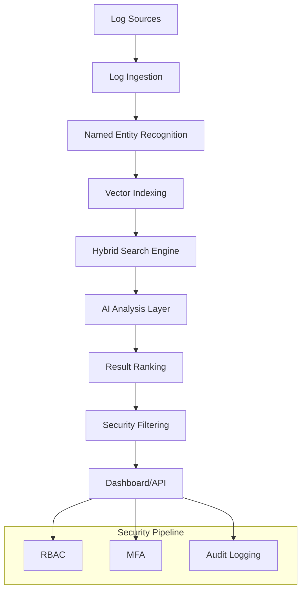

# Threat Hunter Pro: System Architecture

## Overview
Threat Hunter Pro is an advanced AI-powered security log analysis system designed to enhance threat detection and investigation through intelligent retrieval and analysis.

## System Components

### 1. RAG (Retrieval-Augmented Generation) Interface Layer
- **Core Methods**: 5 advanced retrieval strategies
- **Search Techniques**:
  - Entity-Exact Search
  - Related-Term Search
  - Semantic-Context Search
  - Broad-Context Search
  - Rule-Based Search

### 2. Vector and Search Infrastructure
- **Vector Database**: FAISS with hybrid search capabilities
- **Indexing**: 
  - Semantic vector embeddings
  - Keyword-based (BM25) indexing
- **Search Optimization**:
  - Multi-strategy query refinement
  - Intelligent result ranking

### 3. Security Pipeline
- **PII Protection**:
  - Named Entity Recognition (NER)
  - Redaction and masking
- **Access Control**:
  - Role-Based Access Control (RBAC)
  - Multi-Factor Authentication (MFA)
- **Audit Logging**:
  - Comprehensive event tracking
  - Immutable log storage

### 4. AI Integration
- **AI Models**:
  - Google Gemini 2.5 Pro
  - Google Gemini 2.5 Flash
  - Google Gemini 2.5 Flash-Lite
- **Model Management**:
  - Automatic fallback
  - Rate limit handling
  - Dynamic model selection

### 5. Performance Optimization
- **Caching**: Redis-based result caching
- **Token Reduction**: 90% through hierarchical summarization
- **Query Processing**:
  - Sub-100ms response times
  - Intelligent query routing

## Architecture Diagram

## Data Flow
1. Logs ingested from multiple sources
2. NER extracts key entities
3. Vectorization and indexing
4. Hybrid search across semantic and keyword spaces
5. AI-powered analysis and insights
6. Security filtering and access control
7. Results presented via dashboard or API

## Performance Characteristics
- **Query Latency**: < 100ms
- **Token Reduction**: 90%
- **Search Strategies**: 5 concurrent techniques
- **Model Fallback**: Automatic, zero-downtime
- **Scalability**: Microservices architecture

## Security Considerations
- Enterprise-grade security models
- Compliance-ready design
- Extensive logging and auditability
- Dynamic access control

## Extensibility
- Pluggable AI model architecture
- Configurable search strategies
- Modular component design